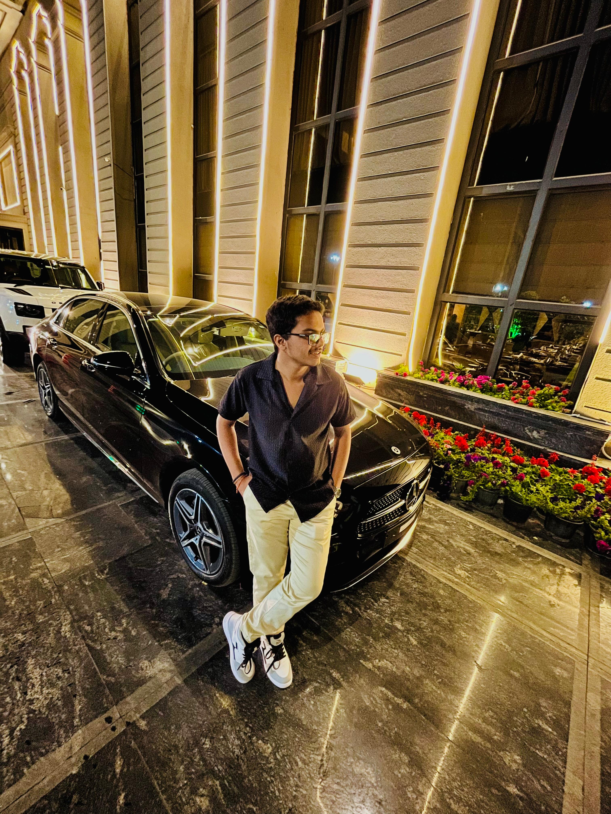

<!DOCTYPE html>
<html lang="en">
<head>
    <meta charset="UTF-8">
    <meta name="viewport" content="width=device-width, initial-scale=1.0">
    <title>My Resume</title>
</head>
<body>
    
    
    <h1 alinement ="left">Ojashwa Soni </h1>
    

    <h2>Education Qualification :-</h2>
    <b><li >10th pass in 2024 </li></b>
    <b><li>Currently in 11th (Subject- PCM) </li></b>
    

    <h2>Work Experience :-</h2>
    <b><li>Worked on a Ecommerce website </li></b>
    <b><li>Designed 4 Websites for different Brands</li></b>
    

    <h2>Skills :-</h2>
          <b><li>Developer in HTML</li></b>
          <b><li> E commerce</li></b>
          <b><li>SEO</li></b>
          <b><li>Canva Designer</li></b>
          <b><li>Photo & Vider Editor </li></b>
          <b><li>Digital Maketing</li></b>
    

    <h2>Awards :-</h2>
    <ul></ul>
    <b><li>Won 1st Prize in School For a Project </li></b>
    <b><li>Won 1st Prize & Trophy in a Canva Designing Competion</li></b>
 
    <footer>©Ojashwa Soni.</footer>

    

    
</body>
</html>
